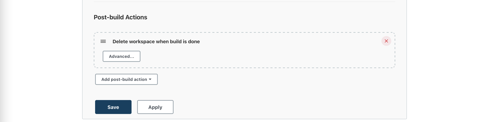

# simple-apps-with-kubernetes
This application contains go and nodejs applications for backend, this repo using Jenkins to build, test, deploy and it will be deployed to Kubernetes cluster.

## Tech Stack
* Jenkins
* Kubernetes cluster (K3s)
* Go
* NodeJS
* docker-compose
* docker

## How to....
Here are the step by step to setup, and configure the deployment, and cicd.

### Setup Builder
1. I use docker-compose to interprete the building process of application, and use shell script to execute the command.
2. Here are the example of the docker-compose and the shell scipt to build.
```yaml
version: "3"
services:
  builder:
    image: golang:1.12.1-alpine
    command: ./build.sh
    working_dir: /src/
    volumes:
      - "./:/src/"
```

```sh
#!/bin/sh 

set -eux

export FAILED=false
export CGO_ENABLED=0

apk add --no-cache git
go mod download
go test ./...
go build -installsuffix 'static' -o ./app ./cmd/app/main.go
```

3. Here is how to execute the command.
```sh
$ docker-compose -f docker-compose.build.yaml run --rm builder
```

### Setup CI/CD
1. For the CI/CD I use Jenkins, and separated the job into 2 jobs. 
  - The first 1 is to build for both go and nodejs, testing, build docker images, and push it to the github container registry. 
  - And the second job is to deploy the apps to the K8s cluster, we can choose what service that need to deploy and what version/image tag.
2. And for the job will be get triggered when there is an event push and/or event PR on the repo, I added webhooks in the repo.
3. Here is the Jenkinsfile for the build(and testing), build docker images, and push the image.
```groovy
#!groovy

pipeline {
    agent any
    options {
        timestamps()
        buildDiscarder(logRotator(numToKeepStr: '5'))
    }

    stages {
        stage("Build") {
            steps {
                sh """
                    docker-compose -f autoapp/docker-compose.yaml run --rm builder
                    docker-compose -f simple-node-app/docker-compose.yaml run --rm builder
                """
            }
        }
        stage("Build docker images") {
            steps {
                withCredentials([string(credentialsId: 'b38c2444-c9e2-4893-afb6-593e3b46ec37', variable: 'CR_PAT')]) {
                    sh """
                        echo ${CR_PAT} | docker login ghcr.io -u iv1310 --password-stdin
                        _MODULE=autoapp ./build-push-image.sh ghcr.io/iv1310 ${BUILD_NUMBER}
                        _MODULE=simple-node-app ./build-push-image.sh ghcr.io/iv1310 ${BUILD_NUMBER}
                    """
                }
            }
        }
    }
    post {
        always {
            cleanWs()
        }
    }
}
```


4. And for the deploy job, I use freestyle job in the Jenkins.
  - Here is the config to discardOldBuild.
  
  - Here is to set the paramters that will be used to decided which service and which image_tag.
  
  
  - Here is to set the source code management, I use Git to pull the code and manifest from my github repo.
  
  - Here is to use secret_file for the kubeconfig credentials.
  
  - Here is the build environment, I use execute shell to define which service that I'll deploy, change the docker_image tag, and deploy the deployment using kubectl.
  
  - And the last thing is the post-build, I configure it to clean up the workspace after all of the process.
  

### Setup Deployment to Kubernetes
1. For the cluster, I use K3s with 1 master and 1 worker, and 1 LB for both kube-apiserver and LB for HTTP/HTTPS.

2. I created 1 namespace called sandbox for all of the workload, and use Github private registry, so I had to create a dockerconfig so that the cluster can pull the image from it.
3. And for the workload, I prepared deployment, service, and ingress.
4. And for the deployment I use kubectl from jenkins to deploy it to the K8s cluster.
5. Here is the example of the deployment.


#### References
* [https://itnext.io/setup-your-own-kubernetes-cluster-with-k3s-b527bf48e36a](https://itnext.io/setup-your-own-kubernetes-cluster-with-k3s-b527bf48e36a)
* [https://docs.github.com/en/packages/working-with-a-github-packages-registry/working-with-the-container-registry](https://docs.github.com/en/packages/working-with-a-github-packages-registry/working-with-the-container-registry)
* [https://github.com/derekahn/autoapp](https://github.com/derekahn/autoapp)
* [https://github.com/joshuarwynn/simple-node-app](https://github.com/joshuarwynn/simple-node-app)
